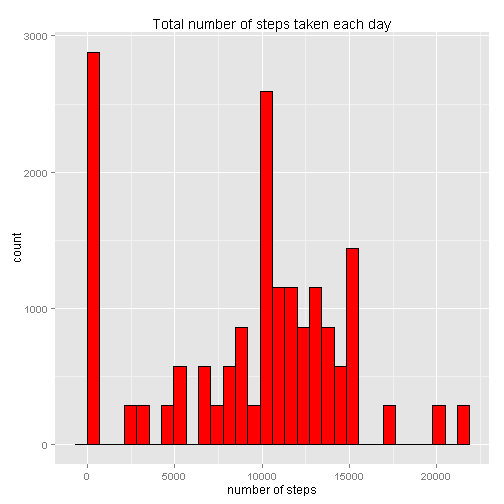
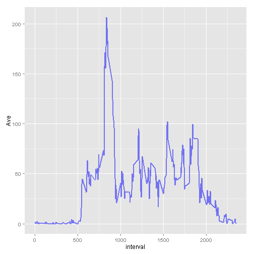
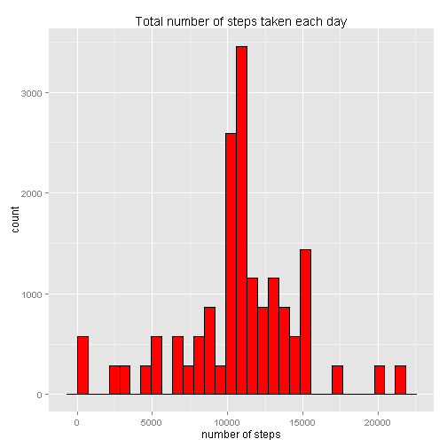
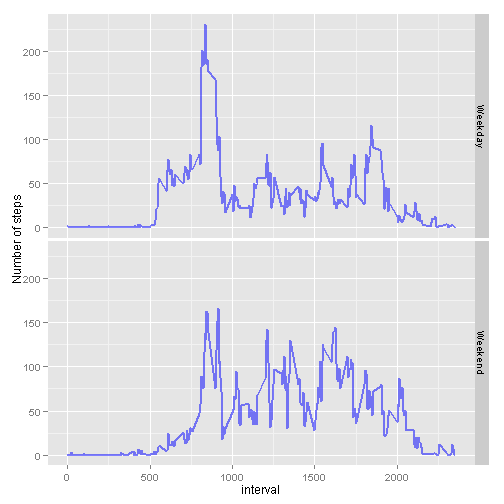

# Reproducible Research: Peer Assessment 1
It is now possible to collect a large amount of data about personal
movement using activity monitoring devices such as a
[Fitbit](http://www.fitbit.com), [Nike
Fuelband](http://www.nike.com/us/en_us/c/nikeplus-fuelband), or
[Jawbone Up](https://jawbone.com/up). These type of devices are part of
the "quantified self" movement -- a group of enthusiasts who take
measurements about themselves regularly to improve their health, to
find patterns in their behavior, or because they are tech geeks. But
these data remain under-utilized both because the raw data are hard to
obtain and there is a lack of statistical methods and software for
processing and interpreting the data.

This assignment makes use of data from a personal activity monitoring
device. This device collects data at 5 minute intervals through out the
day. The data consists of two months of data from an anonymous
individual collected during the months of October and November, 2012
and include the number of steps taken in 5 minute intervals each day.

## Data

The data for this assignment can be downloaded from the course web
site:

* Dataset: [Activity monitoring data](https://d396qusza40orc.cloudfront.net/repdata%2Fdata%2Factivity.zip) [52K]

The variables included in this dataset are:

* **steps**: Number of steps taking in a 5-minute interval (missing
    values are coded as `NA`)

* **date**: The date on which the measurement was taken in YYYY-MM-DD
    format

* **interval**: Identifier for the 5-minute interval in which
    measurement was taken


The dataset is stored in a comma-separated-value (CSV) file and there
are a total of 17,568 observations in this dataset.


## Load data and necessary library
load data

```r
data <- read.csv("activity.csv", header = TRUE)
```


Load necessary librarys

```r
suppressPackageStartupMessages(library(ggplot2))
suppressPackageStartupMessages(library(dplyr))
```


## What is mean total number of steps taken per day?
Group data by date and caculate the total number of steps taken per day

```r
DailySteps1 <- data %.% group_by(date) %.% mutate(sum = sum(steps, na.rm = TRUE))
```

Make a histogram of the total number of steps taken each day

```r
qplot(sum, data = DailySteps1) + geom_histogram(color = "black", fill = "red") + 
    labs(title = "Total number of steps taken each day") + labs(x = "number of steps")
```

```
## stat_bin: binwidth defaulted to range/30. Use 'binwidth = x' to adjust this.
## stat_bin: binwidth defaulted to range/30. Use 'binwidth = x' to adjust this.
```

 


Caculate **mean**  total number of steps taken per day

```r
Mean1 <- mean(DailySteps1$sum, na.rm = TRUE)
```

Caculate **median** total number of steps taken per day

```r
Median1 <- median(DailySteps1$sum, na.rm = TRUE)
```


## What is the average daily activity pattern?
Group data by interval and caculate average number of steps averaged across all days

```r
DailyPattern <- data %.% group_by(interval) %.% summarize(Ave = mean(steps, 
    na.rm = TRUE))
```

Make a time series plot of the 5-minute interval (x-axis) and the average number of steps taken, averaged across all days (y-axis)


```r
ggplot(DailyPattern, aes(interval, Ave)) + geom_line(color = "blue", size = 0.8, 
    alpha = 1/2)
```

 


Which 5-minute interval, on average across all the days in the dataset, contains the maximum number of steps?

```r
DailyPattern[which.max(DailyPattern$Ave), 1]
```

```
## [1] 835
```


## Imputing missing values

Calculate and report the total number of missing values in the dataset

```r
NArows <- is.na(data$steps)
sum(NArows)
```

```
## [1] 2304
```


Create a new dataset that is equal to the original dataset but with the missing data filled in.

```r
## get inverval value for these NA rows
NArowsInterval <- data[NArows, 3]

## find the corresponding interval for these NA rows in daily average
NArowsSteps <- DailyPattern[match(NArowsInterval, DailyPattern$interval), 2]

## copy data and replace NA in steps with average value
NewData <- data

NewData$steps[NArows] <- NArowsSteps

## sanity check
sum(is.na(NewData$steps))
```

```
## [1] 0
```


Make a histogram of the total number of steps taken each day

```r
## group data by date
DailySteps2 <- NewData %.% group_by(date) %.% mutate(sum = sum(steps, na.rm = TRUE))

qplot(sum, data = DailySteps2) + geom_histogram(color = "black", fill = "red") + 
    labs(title = "Total number of steps taken each day") + labs(x = "number of steps")
```

```
## stat_bin: binwidth defaulted to range/30. Use 'binwidth = x' to adjust this.
## stat_bin: binwidth defaulted to range/30. Use 'binwidth = x' to adjust this.
```

 


Caculate **mean**  total number of steps taken per day

```r
Mean2 <- mean(DailySteps2$sum, na.rm = TRUE)
```

Caculate **median** total number of steps taken per day

```r
Median2 <- median(DailySteps2$sum, na.rm = TRUE)
```


Do these values differ from the estimates from the first part of the assignment? What is the impact of imputing missing data on the estimates of the total daily number of steps?

```r

## create a data frame to store mean and median
CompareValues <- data.frame(Mean = c(Mean1, Mean2), Median = c(Median1, Median2))
rownames(CompareValues) <- c("raw", "filled")

CompareValues
```

```
##         Mean Median
## raw     9354  10395
## filled 10766  10766
```

Obviously, means and medians increases after imputing missing values


## Are there differences in activity patterns between weekdays and weekends?

Create a new factor variable in the dataset with two levels -- "weekday" and "weekend" indicating whether a given date is a weekday or weekend day.


```r
Sys.setlocale("LC_TIME", "English")
```

```
## [1] "English_United States.1252"
```

```r

## using new data with no missing value
data2 <- NewData

## convert date from character to Date
data2$date <- strptime(data2$date, "%Y-%m-%d")

## covert Date to weekday and then to number (0 to 6 start on Sunday) and
## then to character
data2$weekdays <- as.character(as.POSIXlt(data2$date)$wday)

## classify each day as weekend or weekdays
data2$weekdays[which(data2$weekdays == "0" | data2$weekdays == "6")] <- "Weekend"
data2$weekdays[which(data2$weekdays != "Weekend")] <- "Weekday"

## create two factors
data2$weekdays <- factor(data2$weekdays)
```


Make a panel plot containing a time series plot  of the 5-minute interval (x-axis) and the average number of steps taken, averaged across all weekday days or weekend days (y-axis).


```r
DailyPattern3 <- data2 %.% select(steps, weekdays, interval) %.% group_by(interval, 
    weekdays) %.% summarize(Ave = mean(steps, na.rm = TRUE))

ggplot(DailyPattern3, aes(interval, Ave)) + geom_line(color = "blue", size = 0.8, 
    alpha = 1/2) + facet_grid(weekdays ~ .) + labs(y = "Number of steps")
```

 

By comparing the two panels, we can see that weekday and weekend has similiar trend, but also some difference. For example,

1. Peak around 800th interval in weekday is higher than that of weekend.

1. steps in weekday has a rapid increase around 500th interval. but steps in weekend increase gradualy from 500 th interval. This
indicates a rush hour during weekday morning, and leisure on weekend morning.

1. There is a peak around 2000th interval in weekend. Steps in weekday has already decreased around 2000th interval. This indicate a early bed time for weekday.

